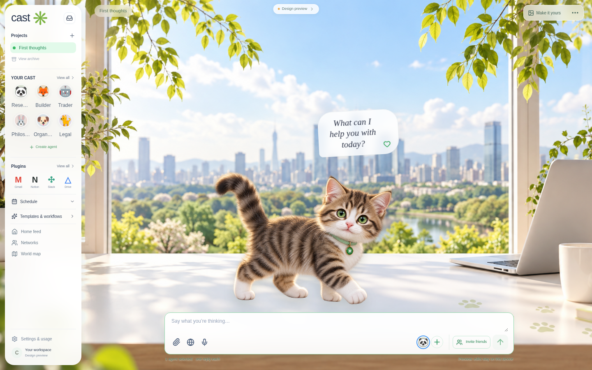

# Cast

Cast is a workspace for saved AI characters, projects, conversations, knowledge, workflows, and community spaces. The redesign includes a scenic chat workspace, customizable Home and Networks views, and an interactive world map.

There are two builds: the connected Next.js application and a static click-through design preview. **No public site is verified yet.** The preview saves changes on the visitor's device and does not generate AI replies, sign in accounts, or execute background jobs. Real, synthetic Gemini replies are verified separately; authenticated hosted chat and managed persistence still need the service setup below.

The working name is temporary; trademark clearance has not been performed.

## What is here

- Next.js 16.3.8, React 19.3.0, TypeScript 5.9, Node 24. The installed Next.js guides were consulted for routing, cookies, auth, environment variables, and hosting.
- Supabase Auth, PostgreSQL with row-level security, and private Storage. Apply every ordered SQL migration in `supabase/migrations`.
- An official server-side Gemini SDK adapter, with bounded streaming conversations, document retrieval, explicit permissions, atomic quotas, and measured usage records.
- A responsive character shelf and project workspace, character editing, workflows, community views, a persistent inbox, and a PWA manifest and offline page.
- An isolated Vite preview in `preview/`, using the same React interface with a browser-local data adapter and no production credentials.
- A real local auth/database/storage/email stack for development and integration tests. Local fixtures have no access to external services.

[Capability ledger](docs/CAPABILITIES.md), [test evidence](docs/TEST_RESULTS.md), [deployment instructions](docs/DEPLOYMENT.md), [cost assumptions](docs/COSTS.md), and [next-release backlog](docs/BACKLOG.md) describe the exact state. The original request is preserved in [PRODUCT_SPEC.md](docs/PRODUCT_SPEC.md).

## Try the design preview

The owner has enabled GitHub Pages with **Source → GitHub Actions**, and its HTTPS configuration is verified. The publication workflow is prepared but its first design-preview deployment still needs to pass. The configured site address is `https://whtefox57-hash.github.io/AI-app-consumer-focused/`; it is not a working preview until the workflow deploys the assets. The source repository and its screenshots are not a deployed site.

The preview supports navigation and local editing of agents, projects, notes, workflows, community content, and map places. Settings and edits survive refresh in the same browser. Original uploads remain in browser IndexedDB; PDF text extraction requires the connected app. Human messages are saved without invented assistant responses. A saved schedule does not run in the preview. The interface labels this mode and explains the service boundary.

To run the standalone preview on a development machine, use Node 24; Docker and provider keys are not needed:

```sh
npm ci --no-audit --no-fund
npm ci --prefix preview --no-audit --no-fund
npm run dev --prefix preview
```

Vite serves it at `http://127.0.0.1:4173`. The connected Next.js app also exposes the same design preview at `/preview`. These local addresses are development instructions, not public links.

## Run locally

Use Node 24 and Docker. This cloud workspace uses a writable npm cache:

```sh
cd /workspace/AI-app-consumer-focused
export NPM_CONFIG_CACHE=/workspace/.cache/npm
npm ci --no-audit --no-fund
```

In one terminal:

```sh
npm run local:start
```

In a second terminal:

```sh
AI_ENABLED=false npm run local:dev
```

The backend proxy listens on loopback port 54321; Next.js listens on port 3000. These loopback backend bindings work for browsers on this machine, including the integration tests. An external port preview needs a managed Supabase URL accessible to the user's browser; the local launchers are not a remote mobile preview. The local backend uses digest-pinned GoTrue, PostgREST, Storage, Mailpit, and PostgreSQL containers with durable `cast-local-db` and `cast-local-files` Docker volumes. Re-running startup reuses compatible containers and applies unapplied migrations. It does not drop user data.

For a production-mode local check, stop the development server and run:

```sh
AI_ENABLED=false npm run local:build
AI_ENABLED=false npm run local:serve
```

Local sign-up is auto-confirmed; local recovery email is captured in Mailpit on loopback port 54324. No email is sent to external recipients. The `local:*` launchers inject public test credentials and must never be used for a hosted deployment.

In a third terminal, run `AI_ENABLED=false npm run local:worker` for reminder delivery independently of the browser. For a managed deployment, supply `APP_URL` and `CRON_SECRET` securely and use `npm run worker`. Local fixture values are declared in `scripts/local-stack.ts`. The browser integration test starts a separate worker and verifies a durable reminder with the browser closed.

Stop the app and backend proxy with Ctrl-C. `npm run local:stop` stops only Cast's named containers; it preserves both durable volumes.

## Checks

```sh
npm run typecheck
npm test
AI_ENABLED=false npm run test:browser
AI_ENABLED=false npm run local:build
```

The browser suite requires the running local backend. It starts a dev server if port 3000 is unused, or checks an existing server. Always use an AI-disabled local server: the tests exercise the missing-provider path and must not spend a production allowance. This cloud uses `/usr/bin/chromium`; elsewhere install Playwright Chromium and set `CHROMIUM_PATH`, or use the checked-in GitHub Actions workflow.

Earlier remote CI runs timed out during the combined readiness/browser step. The revised workflow separates type, database, and build checks from browser integration, bounds startup requests and test duration, and retains failure logs. Its new remote results must be verified after publishing; local results do not establish a remote pass.

## Connect the real services

1. Use the existing Supabase project `ffvzjewuccvwpbpdlwhm`. Correct public URL/key delivery, configure the backend service-role key, and apply migrations and auth redirects as documented in `DEPLOYMENT.md`.
2. Create a Google AI Studio / Gemini Developer API project linked to active billing. The owner funds access; ordinary users never enter model keys. Review current paid-service data terms and prices, enter `GEMINI_API_KEY` securely in environment/hosting settings, then explicitly set `GEMINI_PAID_PROJECT=true`.
3. Provide a hosting account that supports Next.js/Node 24, such as Vercel, and a supported cron or separate worker. Set production secrets on that host; cloud workspace settings do not populate a host automatically.
4. Apply the saved cloud network settings so official documentation and provider domains can be reached. Saving a draft does not activate those settings or deploy software.
5. Run `npm run probe:ai`, deploy, then prove the authenticated hosted conversation flow and complete the remaining acceptance checks.

The configured `gemini-flash-latest` alias returned `gemini-3.8-flash` in a real synthetic generation on 2026-10-02. The lower-cost stable `gemini-3.5-flash-lite` also passed a real synthetic generation; pin that ID in production for the cost plan in `COSTS.md`. The optional stronger alias is `gemini-pro-latest`, disabled by default. Speech is disabled and its legacy TTS default needs live acceptance or migration to a supported current speech model. Current official model, pricing, paid-data, Supabase-plan and Vercel-cron documentation was reached successfully. Billing attestation remains false. `npm run probe:ai -- --connection-only` uses only a fixed generic prompt and does not enable personal conversations. Keep speech, grounded research, the stronger model, and music disabled until their acceptance passes.

## Private data and limits

Every private table has ownership policies; private upload paths start with the user's UUID. Agent memory and project evidence have separate explicit permissions. Documents are untrusted evidence. TXT, Markdown, and selectable-text PDFs are supported, with 5 MB/file, 100 PDF pages, 160,000 extracted characters, and 20 documents/project; scanned PDFs require later OCR.

Connected-app exports contain paginated records, extracted text, and original-upload download links valid for one hour. Download originals before deleting the account. Account deletion removes files and then deletes the auth identity and cascading records. The connected app's browser storage and service worker do not cache conversations or private files. The separate design preview intentionally stores its own edits, human messages, and files on the visitor's device; its file export links work only in that browser while the page remains open.

Defaults are 40 reserved calls/user/day and 400/app/day, including failed calls. A response has at most 8,000 input and 1,500 output tokens. A roundtable supports up to ten responders, runs at most three model calls concurrently, and saves one completed reply per responder. Summaries are deliberate user actions. The owner dashboard can pause AI and reduce quotas. These are call/token limits, not a guaranteed dollar spending cap; see `COSTS.md`.

## Earlier local build screenshot

This screenshot records the earlier local application with a temporary test account. It predates the scenic redesign and does not show a hosted deployment or an invented assistant response.


